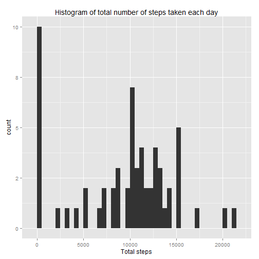
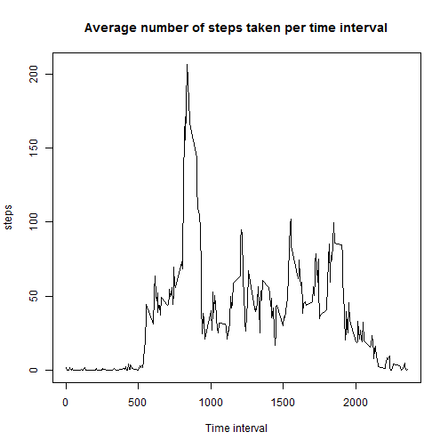
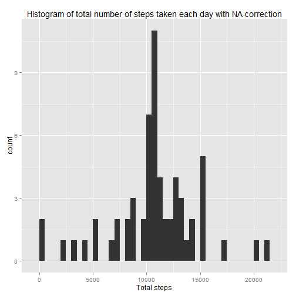
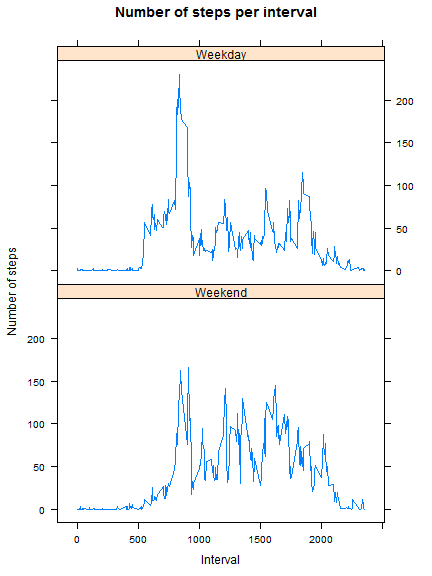

This is an R Markdown document. 
When you click the **Knit** button a document will be generated that includes both content as well as the output of any embedded R code chunks within the document. 

This document is build for Peer Assessment 1 for Coursera's Reproducible Research course. See the README.md file for an explanation of the Assessment. This document describes the questions we have answered and which code we used to answer those questions.  

### Loading and preprocessing the data
Show any code that is needed to

1.Load the data (i.e. read.csv())

2.Process/transform the data (if necessary) into a format suitable for your analysis
 
We start with loading some packages, if necessay setting the working directory and loading the data.


```r
library(plyr)
library(ggplot2)
#setting which makes sure large numbers are not written in scientific way
options(scipen=5, digits=1)
#setwd("C:/Users/Brenda/Documents/Coursera/Reproducible Research")
data <- read.csv("activity.csv")
```

### What is mean total number of steps taken per day
For this part of the assignment, you can ignore the missing values in the dataset.

1. Calculate the total number of steps taken per day:

```r
total_steps <- ddply(data, .(date), summarise, steps = sum(steps, na.rm = TRUE))
```
2. If you do not understand the difference between a histogram and a barplot, research the difference between them. Make a histogram of the total number of steps taken each day

Below is a histogram of the total number of steps taken each day

```r
qplot(total_steps$steps, geom="histogram", binwidth = 500, xlab = "Total steps") + ggtitle("Histogram of total number of steps taken each day")
```

 

3. Calculate and report the mean and median of the total number of steps taken per day

```r
mean<-mean(total_steps$steps)
median<-median(total_steps$steps)
```
The mean of the total number of steps taken per day is 9354.2 and the median is 10395. 

### What is the average daily activity pattern?

1. Make a time series plot (i.e. type = "l") of the 5-minute interval (x-axis) and the average number of steps taken, averaged across all days (y-axis)


```r
#first calculate average number of steps taken per interval averaged across all days
steps_interval <- ddply(data, .(interval), summarise, steps = mean(steps, na.rm = TRUE))
#generate the time series plot
plot(steps ~ interval, steps_interval, xlab="Time interval", type = "l")
title("Average number of steps taken per time interval")
```

 

2. Which 5-minute interval, on average across all the days in the dataset, contains the maximum number of steps?


```r
max<-steps_interval[steps_interval$steps==max(steps_interval$steps),1]
```
The interval 835 contains the maximum number of steps averaged across all days in the dataset. 

### Imputing missing values

Note that there are a number of days/intervals where there are missing values (coded as NA). The presence of missing days may introduce bias into some calculations or summaries of the data.

1.Calculate and report the total number of missing values in the dataset (i.e. the total number of rows with NAs)


```r
data_na <- data[is.na(data$steps),]
na_rows <- nrow(data_na)
```
The total number of rows with NAs are 2304. 

2.Devise a strategy for filling in all of the missing values in the dataset. The strategy does not need to be sophisticated. For example, you could use the mean/median for that day, or the mean for that 5-minute interval, etc.

Data exploration shows that data of a few whole days are missing. Therefore, the strategy that I have chosen is to fill the missing values with the average of the time interval.


```r
#fill NA's with average of interval
colnames(data_na) <- c("Steps", "Date1", "Interval1")
fillNAs <- merge(steps_interval, data_na, by.x= "interval", by.y = "Interval1")
```

3.Create a new dataset that is equal to the original dataset but with the missing data filled in.


```r
#reorder columns
data_na_updated <- fillNAs[c(2,4,1)]
#create set without NA's 
data_Not_na <- data[!is.na(data$steps),]
#update colnames
colnames(data_na_updated)<-c("steps", "date", "interval")
#create dataset that is equal to the original dataset but with the missing data filled in.
final<-rbind(data_Not_na, data_na_updated)
```


4.Make a histogram of the total number of steps taken each day and Calculate and report the mean and median total number of steps taken per day. Do these values differ from the estimates from the first part of the assignment? What is the impact of imputing missing data on the estimates of the total daily number of steps?


```r
#calculate total steps after correcting the NA's
total_steps_na_correction <- ddply(final, .(date), summarise, steps = sum(steps, na.rm = TRUE))
#Create a histogram
qplot(total_steps_na_correction$steps, geom="histogram", binwidth = 500, xlab = "Total steps") + ggtitle("Histogram of total number of steps taken each day with NA correction")
```

 

```r
#Calculate mean and median
mean_na_correction<-mean(total_steps_na_correction$steps)
median_na_correction<-median(total_steps_na_correction$steps)
```

The mean before NA correction was 9354.2 and after NA correction the mean is 10766.2, so correction for NA's does impact the mean. The median before NA correction was 10395 and after NA correction the median is 10766.2, so correction for NA's does impact the median as well. 

## Are there differences in activity patterns between weekdays and weekends?


For this part the weekdays() function may be of some help here. Use the dataset with the filled-in missing values for this part.

1.Create a new factor variable in the dataset with two levels weekday and weekend indicating whether a given date is a weekday or weekend day.


```r
#make sure the date column is recognizes as a date 
final$date <- as.Date(final$date)
#make a new column containing the weekdays 
final$weekday <- weekdays(final$date, abbreviate=FALSE)
#make a new colum with transforms the Saturday and Sunday into Weekend, rest in Weekday
final$weekclass <- ifelse(final$weekday == "Saturday"| final$weekday == "Sunday", "Weekend", "Weekday")
```

2.Make a panel plot containing a time series plot (i.e. type = "l") of the 5-minute interval (x-axis) and the average number of steps taken, averaged across all weekday days or weekend days (y-axis). See the README file in the GitHub repository to see an example of what this plot should look like using simulated data.


```r
#Calculate the average number of steps per weekclass variable and per interval
total_day <- ddply(final, .(weekclass, interval), summarise, steps = mean(steps, na.rm = TRUE))
#load library lattice
library(lattice)
#generate plot similar to the example
 xyplot(total_day$steps~total_day$interval|total_day$weekclass, scales=list(cex=.8),,
    xlab="Interval", ylab="Number of steps", type="l",index.cond = list(2:1),
    main="Number of steps per interval") 
```

 

I hope you enjoyed reading this report. 
